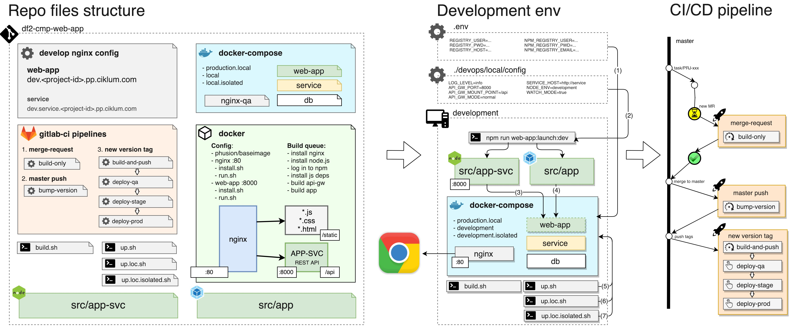
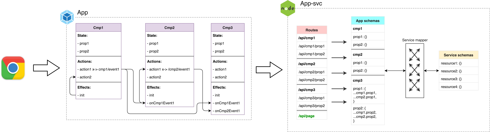

# WEB-APP: APP-SVC (node.js) + APP(react.js)

`Web application` component which consist of `app-svc` and react `app`

<!-- toc -->
- [Overview](#overview)
    - [How to read diagram](#how-to-read-diagram)
        - [Diagram notes](#diagram-notes)
- [Repo structure](#repo-structure)
    - [Folder/files structure](#folderfiles-structure)
- [Development env](#development-env)
    - [Preparation](#preparation-initial-start)
        - [ENV variables](#env-variables)
        - [.env](#env)
            - [./devops/local/config/*](#devopsdevelopmentconfig)
    - [Web-app](#web-app)
        - [Dependencies](#dependencies)
        - [Scripts](#scripts)
        - [Api-service](#app-svc)
            - [Isolation mode](#isolation-mode)
        - [App](#app)
            - [Airbnb React/JSX style with some extra rules:](#airbnb-reactjsx-style-with-some-extra-rules)
            - [Styled components](#styled-components)
            - [Code styleguide](#code-styleguide)
                - [Component based structure](#component-based-structure)
                - [Strict Module Boundaries](#strict-module-boundaries)
                - [Relative path](#relative-path)
            - [Naming convention](#naming-convention)
                - [Redux actions](#redux-actions)
                - [Components](#components)
    - [Docker](#docker)
        - [Hosts](#hosts)
- [CI/CD](#cicd)
- [Links](#links)

<!-- tocstop -->

# Overview
General `web-app` structure is intended to be as close as possible to production runtime. It is docker & gitlab based considering df2 approach. It contains gitignored configs to reach remote services and development fake creds to run configureless images considering security policies.



## How to read diagram

You have to read diagram from left to right.

First block illustrate repo file structure. And what kind of config it contains:

- development nginx config - to run `web-app` container locally
- docker-compose config - to combine `service` with `web-app` locally
- gitlab-ci config - to setup pipeline jobs config for `web-app`
- docker config - to build `web-app` image locally and via ci jobs
- bash scripts - to build and run in develop & isolated mode `web-app` locally

Second block shows how this configuration runs on developer machine:

- gitignored `.env` file used
- develop config used
- docker-compose starts all necessary containers and connect local sources to the `web-app` container. Which is previously built (run ./build.sh at least once)
- under the hood the `npm run web-app:launch:dev` is used to monitor changes. It works even under the docker
- `web-app` is available from Chrome via docker-compose containers

Last block describes how the CI/CD pipeline works:

- After new branch pushed and merge-requested created `build-only` job automatically started to check image build
- When merge-request merged `bump-version` job automatically started to update version according to MR title key word (patch/minor/major)
- When new tag appear on master then `build-and-push` job automatically started to build and push new image. On success you can manually deploy it on qa -> stage -> prod

## Diagram notes

**(1)** `.env` file used for local build. It contains creds to remote services and should be gitignored

**(2)** development config with app settings is used by `npm` script. This script can be used on host machine without docker. Same script will be executed by docker when `run.*.sh` used

**(3)** `app-svc`itself available on `:8000` port without docker. And it is a part of `web-app-qa` container

**(4)** `app` js files is a part of `web-app` container built and bundled in image. Or for dev scripts they are build in runtime by `webpack`

**(5)** `run.sh` runs `web-app` image with fake `production.local` configs to make final test before `merge-request`.

**(6)** `run.dev.sh` runs `web-app` image with `development` configs in `normal` mode. It means that `app-svc` will make requests to `service` (using config)

**(7)** `run.dev.isolated.sh` runs `web-app` image with `development.isolated` configs in `isolated` mode. It means that `app-svc` will use own mocks without knowing `service` schemas at all.

# Repo structure

Repo contains such parts:

- config
	- remote services creds (docker & npm registry, .env gitignored)
	- development fake config (normal & isolated not used for stage & prod)
- docker config
	- build & run images locally
	- bundle app-svc & static assets together
- gitlab ci/cd pipeline config
- helper script to manage docker


## Folder/files structure
- **/devops** - manual/auto deploy/build scripts/configs
  - **/ci** - ci scripts
  - **/docker** - docker related scripts/configs
      - **/docker-compose** - env related docker-compose files
      - **/local** - local nginx config
      - **/scripts** - helper scripts
      - **/services** - runit service setup
           - **/nginx** - nginx config
           - **/web-app** - web-app run-it setup
      - **Dockerfile** - main config to build `app-svc` + `app`
  - **/local** - only for local development
      - **/config** -  predefined configs for envs
      - **/scripts** - general purpose scripts
      - **nginx** - development env nginx config
  - **definitions.sh** - docker names config
- **/dist** - all binaries should be here
	   - **app-svc** - `app-svc` binaries for prod
	   - **static** - `app` binaries with assets
- **/src** - source code
      - **/app** - web application source code
      - **/app-svc** - app-svc source code
- **package.json** - component meta file (default for js environment). Here the whole `web-app` version history is tracked


# Development env

Web-app consist of two main parts:

- `App-svc` - node.js(express.js) headless application it implement such features:
	- provide app-friendly interface (not binded to `service` business logic)
	- serve static file in development mode
	- provide server-side render service
	- implement `isolated` & `normal` mode to work with `service` app
	- implement schema mapper to adopt `service` business logic to convenient `app` format
- `App` - react application

## Preparation & initial start

- Clone project from gitlab (web-app)
- Add .env file to the project root folder
- Add variables with correct values to .env file using .env.dist file
- Add `dev.ciklum.com 127.0.0.1`, `service-dev.ciklum.com 127.0.0.1` to `/etc/hosts`
- Install dependencies using `npm run web-app:install` script
- Launch `app-svc` in `normal mode` and `app` in `watch mode` using `npm start` script
- Build app bundles using `npm run app:build:dev`
- Start project using `npm run docker:up:dev` script.
- Run `deploy/local/scripts/migration.sh` script
- Restart project
- Check that `service-dev.ciklum.com` works
- Go to `dev.ciklum.com` and check `web-app`


### ENV variables


#### .env

- DOKCER_REGISTRY_USER - docker registry user
- DOCKER_REGISTRY_PWD - docker registry pwd
- DOCKER_REGISTRY_HOST - docker registry host
- NPM_REGISTRY - npm registry host
- NPM_REGISTRY_TOKEN - private npm registry authToken

List of variables:

```
export DOKCER_REGISTRY_USER=<usr>
export DOCKER_REGISTRY_HOST=registry.npmjs.org
export DOCKER_REGISTRY_PWD=<pwd>

export NPM_REGISTRY=registry.npmjs.org
export NPM_REGISTRY_TOKEN=<token>
```
More variables you can see in `.env.dist` file in `master`.

#### ./devops/development/config/*

This vars used for local execution only and cannot affect production

- LOG_LEVEL=info -  can be `debug/info/warn/error` - defines level of logs for `app-svc` & `app`
- APP_SVC_PORT=8000 - default port for `app-svc`
- APP_SVC_MOUNT_POINT=/api
- APP_SVC_MODE=normal - can be `normal/isolated`
- SERVICE_HOST=http://service - default url for working via docker
- NODE_ENV=development
- WATCH_MODE=true - used in docker run script to watch sources in development mode
- SSR=true|false - When `true` app-svc will render on server-side app. When `false` app-svc just respond with layout and bundle links.

## Web-app



After user reaches `app` in chrome(e.g.) such SPA logic used:

- Every module(not dumb component) has its own state(via redux) actions and effects via [@ciklum/exo](https://gitlab.ciklum.net/st-js/module-exo)
- Actions can interconnect via [@ciklum/raax](https://gitlab.ciklum.net/st-js/module-raax) with [@ciklum/xmess](https://gitlab.ciklum.net/st-js/module-xmess) built-int async messaging protocol
- when component needs some data it uses [@ciklum/waas](https://gitlab.ciklum.net/st-js/module-waas) to make requests to `app-svc`

When `app-svc` received request for tha data such things happened:

- every component nesting are reflected by routing nesting 1-1. So it is become very easy to understand with routes should be used for particular component data
- routes handlers uses `service-mapper` to receive/validate and finally map `service` data to `app` schemas
- `app` schemas stored separately and designed to fulfill `app` expectations
- `service` schemas should reflect actual swagger docs of actual service version
- `service-mapper` layer give ability to map freely service data to app format
- /api/page route is default route to serve app html. This route is used under the hood when docker and app-svc launched. The most important feature of this route is to serve server-side-rendered content using `render-mode` query param.

### Dependencies

  - node@^10 - please install `node-js` on your machine using [nvm](https://github.com/creationix/nvm)

When you clone the repo execute such scripts:

```
-> /df2-skeleton$ npm run web-app:install
```

### Scripts

There are default scripts in top level `package.json`:

- `start` - `web-app:launch:dev`
- `docker:build` - execute web-app docker build
- `docker:up` - executes `docker-compose up` using production config
- `docker:up:loc` - executes `docker-compose up` using local config
- `docker:up:loc:isolated` - executes `docker-compose up` using local.isolated config
- `web-app:launch:dev` - launch `app-svc` (`normal` mode) and `app` in watch mode and connect with `service`
- `web-app:launch:dev:isolated` - launch `app-svc` (`isolated` mode) and `app` in watch mode
- `web-app:install` - install `app-svc` & `app` deps
- `web-app:lint` - executes `app-svc` & `app` linting
- `app-svc:launch:dev` - launch `app-svc` in `normal` mode
- `app-svc:launch:dev:isolated` - launch `app-svc` in `isolated` mode
- `app-svc:launch:prod:local` - launch `app-svc` in `normal` `production.local` mode
- `app-svc:launch` - launch `app-svc` in `production.local` mode
- `app-svc:build` - build `app-svc` binaries
- `app-svc:build:dev` - build `app-svc` development binaries
- `app-svc:test` - launch `app-svc` in test
- `app-svc:lint` - launch `app-svc` lint
- `app-svc:install` - install `app-svc` deps
- `app:build` - build `app` binaries in `production` mode
- `app:build:dev` - build `app` binaries in `development` mode
- `app:watch` - run `app` watcher
- `app:lint` - launch `app` lint
- `app:install` - install `app` deps

Please read the corresponding `package.json` file to check them.

### App-svc

It's express.js based application which implements api-gateway pattern. Its purpose is to make `service` and web `app` less coupled. So when `app` make request, `app-svc` orchestrate it to proper `service` resources. Then `app-svc` map data from `service` schemas to `app` schemas.

Second purpose of `app-svc` is to serve static files of `App`. There is default endpoint: `/` from which app is served. Additional query params can be passed through it to be processed by `app-svc` or `app`.

#### Isolation mode

There is `APP_SVC_MODE` variable exists. There is two possible modes:

- `isolated` - all requested from `app-svc` to `service` are mocked and mock data processed by `app-svc` route handlers
- `normal` - all requests to `service` executed via http

Please check existing config files in `./devops/local/config/*.env`.


### App

It's React based SPA. It's executed in browser and make request to its origin(`app-svc`)

#### Airbnb React/JSX style with some extra rules:

1) Do not use semicolon in the end of line (error)

2) Whitespace required between the function name or function keyword and the opening parentheses

3) Do not use default exports

[(read more)](https://github.com/airbnb/javascript/tree/master/react)


#### Code styleguide

##### Component based structure

Every logical module should have all necessary react-redux components and should not have dependency from other modules.

Example:
```
/src
  /components
    index.tsx
    Button.jsx
  /modules
    /PageHome
      /components
        /SectionIntro
          index.tsx
          styled-components.js
        index.tsx
      /modules
        /SectionServices
          /components
            index.tsx
            styled-components.js
          constants.js
          index.tsx
          reducer.js
          service.js
      /reducer
        slice1.js
        slice2.js
        index.tsx
      constants.js
      index.tsx
      service.js
```

[(read more)](https://jaysoo.ca/2016/02/28/organizing-redux-application/#rule-1-organize-by-feature).

#### Styled components
We using `ThemeProvider` to define theme variables, try to avoid `css variables`<br />
Do not use `className` when styling!!! Use `props` instead.<br />
All primitives and wrappers should be a styled components. All styled components should be defined in `styled-components.js` within the module

[(read more)](https://www.styled-components.com/)

#### Reducer
If reducer contains small amount of logic we can put all together in `reducer.js` file.<br />
For more complex situation we will use `reducer` folder with `index.tsx` file in it

[(read more)](https://jaysoo.ca/2016/02/28/applying-code-organization-rules-to-concrete-redux-code/#reducers)

##### Strict Module Boundaries
Every logical module should have `index.tsx(x)` which exports all public apis.

[(read more)](https://jaysoo.ca/2016/02/28/organizing-redux-application/#rule-2-create-strict-module-boundaries)

##### Relative path

Boilerplate includes `babel-plugin-module-resolver` that helps to import dependencie via relative path to source directory (`src/` by default)

[(read more)](https://github.com/tleunen/babel-plugin-module-resolver/blob/master/DOCS.md)

#### Naming convention

##### Redux actions

We use basic [flux-standard-action](https://github.com/redux-utilities/flux-standard-action#actions) convention

Every redux action's `type` should be a string in lowercase. It should describe the module name, entity and action. If action fires api-call it should have prefix describe http method.

Example:

```
const TODOS_ALL_GET = 'root/todos/all-get'
{ type: 'root/todos/all-get' }

const TODOS_TOGGLE = 'root/todos/toggle'
{ type: 'root/todos/toggle' }
```

Action `payload` should be an object or array.

Other `meta` information describe action behaviour and other related information.

Example:

```
meta: {
	isLoading: false,
	status: '200'
}
```

##### Components

Every react component (dumb) should named in PascalCase and contains word `Component`.

Example:

```
export const class TodoComponent extends React.Component { }
```

Every connected component (smart) should named according to its entity.

Example:

```
export const Todos = connect(mapStateToProps, mapDispatchToProp(TodoComponent)
```


## Docker

We considering web-app to be used on production in docker. So we need to be as close as possible to that setup on every developer machine. That's why it is better to develop using docker setup.

There are couple of scripts to work with docker:

- `docker:build` - build locally `web-app` docker image. You need to build it at least once before to run it.
- `docker:up` - run web-app docker image with `production.local` fake config
- `docker:up:loc` - run web-app docker image with `local` config and attached sources of `app-svc` & `app` in watch mode. So you can develop your code in IDE and it will be served via docker to browser
- `docker:up:loc:isolated` - same as before, but `app-svc` executed in `isolated` mode. This mode good to use when `service` app unstable or lack of necessary features

**Notes**:
- For Windows users [git bash](https://git-scm.com/download/win) is required to work with scripts

### Hosts

In order to use similar url for every env you need to add this refs in your `etc/hosts` file:

```
127.0.0.1 service-dev.ciklum.com
127.0.0.1 dev.ciklum.com
```

# CI/CD
Please follow [Delivery flow lvl2](https://gitlab.ciklum.net/st/delivery-framework/blob/master/lvl2/README.md) in general and for commits and branches in particular.

There are 3 main pipelines exist considering df2 convention:

1. `merge-request` - when MR created/updated. Please always put in merge request title SemVer reserved word `major/minor/patch`. `patch` will be applied automatically if nothing detected. Test build made by `gitlab-runner` to ensure image is correctly built. Nothing pushed to registry.
2. `master push` - after MR merged to master. Now version bump happened using mr title reserved word if exist. And new tag pushed to repo. Package.json also modified.
3. `new version tag` - when new version tag automatically appear `build-and-push` job started by `gitlab-runner`. Image built had pushed to registry. Now it can be manually deployed to qa-env. After - to stage and to prod accordingly.


# Links
- [Delivery Flow](https://gitlab.ciklum.net/st/delivery-framework)

